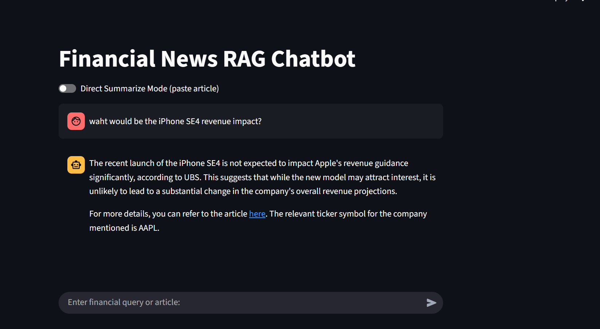
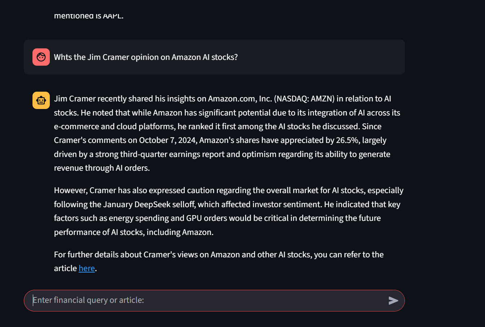
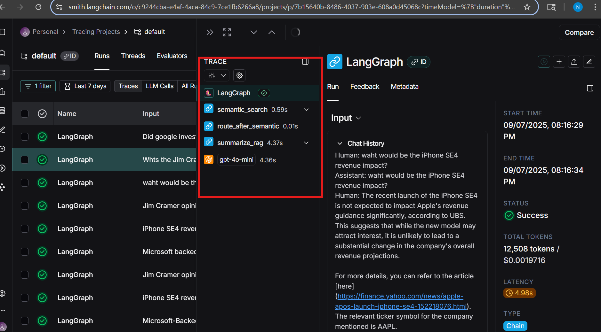
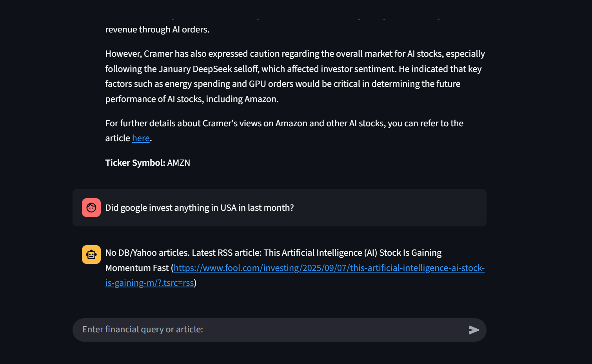
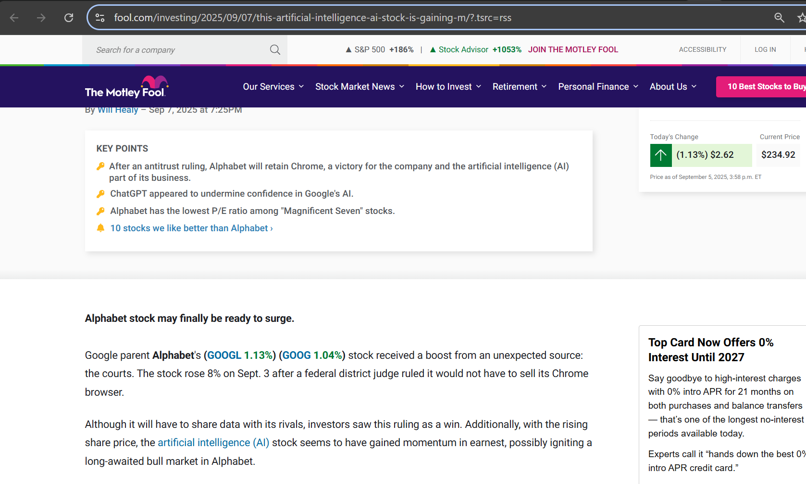
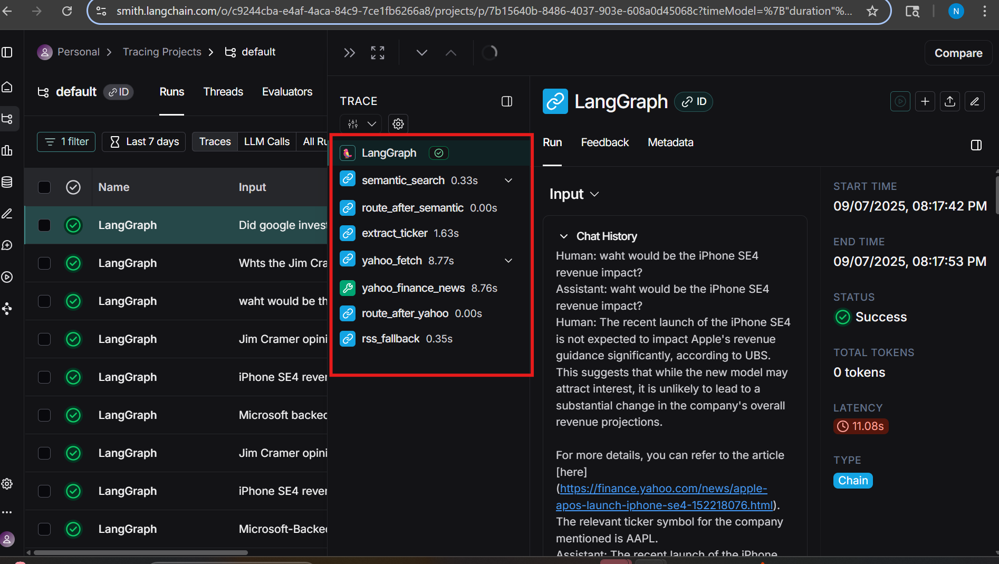

# Demo

When a user asks a question, the chatbot converts the query into embeddings(1536 dimensions), performs semantic search using cosine similarity, and retrieves the top K documents. These are then re-ranked, and the most relevant context is passed to the LLM to generate a response, along with the source or article link as show above

LangSmith traces show each step of the workflow—user query, semantic search, reranker, router, and summarizer—along with their latencies. Using a local Qdrant vector DB, latency is ~4s, but deploying in the cloud with optimized memory and VPC can reduce it to ~400ms. LangSmith helps trace metrics and identify which nodes are triggered in the graph.Here since it found the documnents from vector db it dint use Yahoo API or RSS feeds to get raticles from web search.

Now tested with a query about Google: since no related data existed in the vector DB, the system used the extract_ticker node with OpenAI GPT structured output via LLM to identify the ticker. It then retrieved the article title and link, returning the link as the source. For security reasons, articles anot allowed me to scraped directly, but if allowed, we could display the content to the client within the app.

The above article which is given by chatbot talks about Google Finances as above.

In the LangSmith trace for this query, we can see that semantic search completed quickly since no documents were found, which also reduced rerank and router latency. The extract_ticker node executed next, followed by the Yahoo Finance node and the RSS fallback (as the Yahoo News node failed). The trace highlights that while open-source sources like Yahoo Finance and RSS feeds work, their latency is relatively high.

