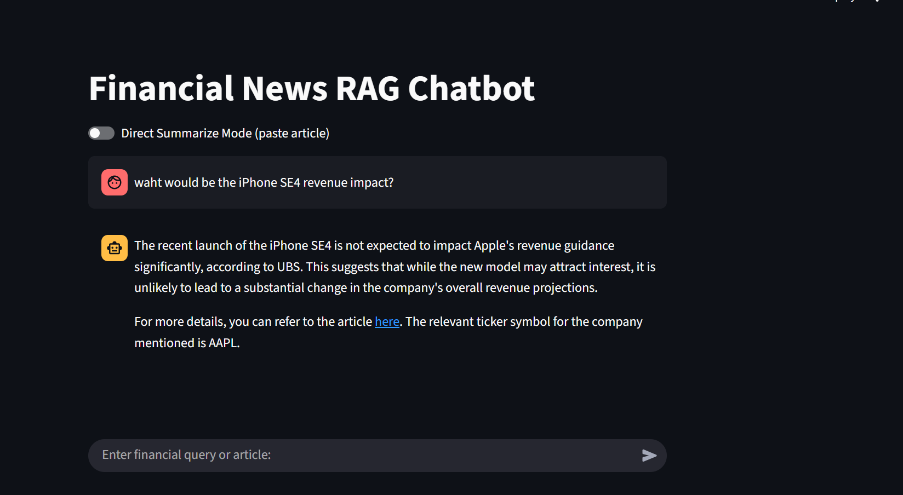

# Financial News RAG Chatbot

A sophisticated Retrieval-Augmented Generation (RAG) chatbot for financial news analysis, built with LangGraph, Streamlit, Yahoo finance and RSS feeds and advanced AI technologies.

## Overview

This application combines multiple AI technologies to provide intelligent financial news analysis:

- **RAG Pipeline**: Semantic search through financial news articles
- **Vector Databse**: Qdrant(HSNW Indexing)
- **LangGraph Workflow**: State-based processing with conditional routing
- **Multi-source Integration**: Qdrant vector database + Yahoo Finance API + RSS Feeds
- **Streamlit UI**: Interactive chat interface with conversation memory
- **Evaluation Framework**: RAGAS-based performance assessment

## Demo




## Architecture

```
┌─────────────────────────┐
│      Streamlit UI       │
│  • User submits query   │
│  • Chat interface       │
└─────────────┬───────────┘
              │
              ▼
┌──────────────────────────┐
│ Query → Embeddings       │
│ • Convert query to vector│
│ • OpenAI text-embedding  │
└─────────────┬────────────┘
              │
              ▼
┌──────────────────────────┐
│ Semantic Search (Qdrant) │
│ • Cosine similarity      │
│ • Top-K relevant docs    │
└─────────────┬────────────┘
              │
              ▼
┌──────────────────────────┐
│ Cross-Encoder Re-ranking │
│ • Re-rank retrieved docs │
│ • Ensure most relevant   │
└─────────────┬────────────┘
              │
              ▼
┌───────────────────────────┐
│ LLM Generation (RAG)      │
│ • Pass top docs as context│
│ • GPT-4o-mini generates   │
│   user response           │
└─────────────┬─────────────┘
              │
        ┌─────┴─────┐
        │           │
        ▼           ▼
┌──────────────┐  ┌──────────────┐
│ If docs found│  │ If no docs   │
│ → Return     │  │ → Extract    │
│   response   │  │   ticker     │
└─────┬────────┘  └─────┬────────┘
      │                 │
      ▼                 ▼
   ┌───────────┐   ┌────────────────┐
   │ User gets │   │ Yahoo Finance  │
   │ answer    │   │ API → Headlines│
   └───────────┘   └─────┬──────────┘
                         │
                         ▼
                     ┌───────────────┐
                     │ If Yahoo found│
                     │ → Summarize   │
                     │ Else RSS feed │
                     │ → Latest news │
                     └─────┬─────────┘
                           │
                           ▼
                    ┌───────────────┐
                    │ If nothing    │
                    │ → Return "No  │
                    │ articles found│
                    └───────────────┘

```


**Langgraph Flow with nodes & edges**


## Project Structure

```
ChatBot/
├── app.py                          # Main Streamlit application
├── requirements.txt                # Python dependencies 
├── rag_graph.png                  # Workflow visualization
│
├── pipeline/                       # Core RAG pipeline
│   ├── graph.py                   # LangGraph workflow definition
│   ├── nodes.py                   # Individual processing nodes
│   └── prompts.py                 # AI prompts and templates
│
├── clients/                        # External service clients
│   ├── openai_client.py           # OpenAI API wrapper
│   ├── qdrant_client.py           # Qdrant vector database client
│   └── yahoo_client.py            # Yahoo Finance and RSS API client
│
├── configs/                        # Configuration management
│   └── settings.py                # Environment variables and defaults
│
├── utils/                          # Utility functions
│   ├── logging.py                 # Logging configuration
│   └── helper.py                  # Common helper functions
│
├── data_ingestion_store/           # Data processing pipeline
│   ├── data_ingestion.py          # News ingestion and embedding
│   └── qdrant_storage/            # Vector database storage
│
├── evaluation_ragas/               # Performance evaluation
│   ├── evaluate.py                # RAGAS evaluation script
│   └── evaluation_results.txt     # Evaluation report
│
├── data/                         
│   └── stock_news.json            # Financial news dataset
│
└── logs/                          # Application logs
    └── rag_chat.log               # Chat application logs
```

## 🔧 Core Components

### 1. **LangGraph Workflow** (`pipeline/graph.py`)

The application uses LangGraph to create a state-based workflow with conditional routing:

```python
# Workflow Steps:
1. START → semantic_search - Rerank using cross-encoder
2. semantic_search → summarize_rag OR extract_ticker
3. summarize_rag → END
4. extract_ticker → yahoo_fetch
5. yahoo_fetch → summarize_yahoo OR rss_fallback
6. summarize_yahoo → END
7. rss_fallback → END
```

**Key Features:**
- **Conditional Routing**: Smart decision-making based on search results
- **Fallback Mechanisms**: Multiple data sources for comprehensive coverage
- **State Management**: Persistent state across workflow steps

### 2. **Processing Nodes** (`pipeline/nodes.py`)

Six specialized nodes handle different aspects of the pipeline:

#### **Semantic Search and Re-ranking Node**
- Performs vector similarity search in Qdrant
- Filters results by similarity threshold
- Reranks using the cross-encoder model
- Returns relevant financial news articles

#### **Summarize RAG Node**
- Uses OpenAI GPT to summarize retrieved articles
- Incorporates conversation history for context
- Provides source links and ticker symbols

#### **Extract Ticker Node**
- Uses GPT-4o-mini with structured output using Pydantic BaseModel
- Extracts company tickers from user queries
- Handles conversation context for better accuracy

#### **Yahoo Fetch Node**
- Fetches real-time news from Yahoo Finance
- Uses LangChain's YahooFinanceNewsTool
- Converts results to standardized format

#### **Summarize Yahoo Node**
- Reuses RAG summarization logic
- Processes Yahoo Finance articles
- Maintains consistent output format

#### **RSS Fallback Node**
- Last resort for news retrieval
- Fetches latest headlines from RSS feeds
- Provides basic article information

### 3. **Client Wrappers** (`clients/`)

#### **OpenAI Client** (`openai_client.py`)
```python
class OpenAIClient:
    def chat(self, prompt: str) -> str
    def get_embedding(self, text: str) -> List[float]
```

#### **Qdrant Client** (`qdrant_client.py`)
- Uses gRPC for high-performance vector operations ( It also provides REST api but gRPC supports streaming and bulk vector ingestion with low latency)
- Singleton pattern for connection pooling
- Optimized for large-scale similarity search

#### **Yahoo Client** (`yahoo_client.py`)
- Fetches financial news via LangChain tools
- RSS fallback for latest headlines
- Error handling and logging

### 4. **Streamlit Interface** (`app.py`)

**Features:**
- **Chat Interface**: Natural conversation flow
- **Memory Management**: 5-message conversation buffer
- **Direct Mode**: Paste articles for direct summarization
- **Real-time Processing**: Async pipeline execution
- **Error Handling**: Graceful failure management

## Installation & Setup

### 1. **Prerequisites**
```bash
# Python 3.8+
python --version

# Qdrant Vector Database
docker run -p 6333:6333 -p 6334:6334 qdrant/qdrant
```

### 2. **Install Dependencies**
```bash
cd "ChatBot"
uv pip install -r requirements.txt
```

### 3. **Environment Configuration**
Create a `.env` file:
```env
# OpenAI Configuration
OPENAI_API_KEY=your_openai_api_key_here
OPENAI_LLM_MODEL=gpt-4o-mini
OPENAI_EMBED_MODEL=text-embedding-3-large

# Qdrant Configuration
QDRANT_HOST=localhost
QDRANT_REST_PORT=6333
QDRANT_GRPC_PORT=6334
QDRANT_COLLECTION=news_articles

# LangChain Tracing (Optional)
LANGCHAIN_TRACING_V2=false
LANGCHAIN_API_KEY=your_langchain_api_key
LANGCHAIN_PROJECT=rag-finance

# Data Ingestion
INPUT_JSON=data/stock_news.json
EMBED_CONCURRENCY=8
UPSERT_BATCH_SIZE=64
```

### 4. **Data Ingestion**
```bash
# Ingest financial news data into Qdrant
python data_ingestion_store/data_ingestion.py
```

### 5. **Launch Application**
```bash
streamlit run app.py
```

## Usage

### **Chat Interface**
1. **Open** `http://localhost:8501`
2. **Ask questions** like:
   - "What's the latest news about Apple?"
   - "How is Tesla performing?"
   - "Tell me about Microsoft's AI investments"


### **Conversation Memory**
- Maintains context across 5 messages
- Remembers previous queries and responses
- Enables follow-up questions

## Evaluation Framework

The application includes a comprehensive evaluation system using RAGAS metrics:

### **Evaluation Metrics**
- **Retrieval Precision/Recall**: Document retrieval accuracy
- **ROUGE Scores**: Summary quality assessment
- **Context Relevance**: Retrieved document relevance
- **Answer Faithfulness**: Factual accuracy

### **Test Dataset**
```python
test_data = [
    {
        "query": "Microsoft backed OpenAI on Tuesday introduced SWE-Lancer",
        "relevant_titles": ["Microsoft-Backed OpenAI Introduces SWE-Lancer Benchmark"],
        "reference_summary": "Microsoft-backed OpenAI introduced SWE-Lancer..."
    },
    etc..,
    # ... more test cases
]
```

### **Run Evaluation**
```bash
python evaluation_ragas/evaluate.py
```

## Configuration Options

### **Similarity Threshold**
- **Default**: 0.6
- **Purpose**: Filters search results by relevance
- **Adjustment**: Lower for broader results, higher for precision

### **Memory Window**
- **Default**: 5 messages
- **Purpose**: Conversation context retention
- **Adjustment**: Increase for longer conversations

### **Model Selection**
- **LLM**: gpt-4o-mini (cost-effective)
- **Embeddings**: text-embedding-3-small (high quality and cost effective only 2% difference between small and large models) also used oiepnai since if we s=use oepnsource embedding mdoel, w enee dto sinatl strasnformers fromw hcih we cna use but it isntall torch libarrei and all which make the applciation evry wheavey fro which we can afce preblms whuel deploying due to latger size we nee mor emmeory stprage an cpu so chisesn oepnai embedding model , can go with eipsnourec when we have goo dinfarstrucre
- **Customization**: Modify in `configs/settings.py`

##Troubleshooting

### **Common Issues**


#### 1. **Async/Await Issues**
```python
# Error: object list can't be used in 'await' expression
# Fix: Ensure proper async/await usage in semantic_search_node
```

#### 2. **Qdrant Connection**
```bash
# Ensure Qdrant is running
docker ps | grep qdrant
# Check ports 6333 and 6334
```

#### 3. **OpenAI API Issues**
- Verify API key validity
- Check rate limits and credits
- Ensure model availability

### **Debug Mode**
```python
# Enable detailed logging
import logging
logging.getLogger().setLevel(logging.DEBUG)
```

## Performance Optimization

### **Vector Search**
- **Index Type**: HNSW for fast similarity search and hugh accuracy
- **Distance Metric**: Cosine similarity
- **Batch Processing**: Concurrent embedding generation

### **Memory Management**
- **Connection Pooling**: Singleton clients
- **Async Processing**: Non-blocking operations
- **Batch Operations**: Efficient database updates


## Technical Stack & Architecture Decisions

### AI/ML Stack

#### OpenAI GPT-4o-mini (LLM)
- **Decision:** Chose OpenAI over open-source models  
- **Rationale:**
  - Local infrastructure limitations prevent running large open-source models.
  - Open-source models require dedicated GPUs for optimal performance.
  - GPT-4o-mini is cost-effective and scalable.
  - Future options include upgrading to GPT-3.5 or GPT-4 for higher accuracy.

#### OpenAI text-embedding-3-small (Embeddings)
- **Decision:** OpenAI embeddings over open-source alternatives  
- **Rationale:**
  - Minimal performance loss (~2%) compared to larger models.
  - Deployment efficiency: avoids heavy dependencies like PyTorch and transformers.
  - Smaller memory footprint (~7GB saved) reduces CPU/memory constraints.
  - Optimized for production usage with easy future migration to open-source when feasible.

---

### Vector Database & Search

#### Qdrant Vector Database
- **Decision:** Qdrant over other vector databases  
- **Rationale:**
  - Open-source, full control, no vendor lock-in.
  - Superior performance for financial news search.
  - Highly configurable and cost-effective.
  - Can configure Indexing techniques
  - Can integrate Neo4j Graph databse also.

#### HNSW Indexing
- **Decision:** HNSW over IVF (Inverted File) indexing  
- **Rationale:**
  - Higher accuracy and recall for <1M vectors.
  - Assuming that chatbot need more accuracy.

#### Cosine Similarity
- **Decision:** Cosine similarity for vector comparisons  
- **Rationale:**
  - Works optimally for high-dimensional text embeddings(used 1536 dimensions in our case)  
  - Efficient and widely used in NLP applications.

#### Cross-Encoder Re-ranking
- **Decision:** Use Cross-Encoder for document re-ranking after initial vector retrieval  
- **Rationale:**
  - Ensures the most relevant documents are passed to the LLM for generation  
  - Improves contextual accuracy and relevance of summaries  
  - Works well with high-dimensional embeddings to refine search results  
  - Efficient for small-to-medium document sets where precision is prioritized over raw retrieval speed

---

### Workflow Orchestration

#### LangGraph
- **Decision:** LangGraph for workflow management  
- **Rationale:**
  - Node-based architecture simplifies complex workflows.
  - Built-in state management preserves context.
  - Supports conditional routing and easy debugging.
  - Seamless integration with LangChain ecosystem.

#### LangSmith Integration
- **Decision:** Added LangSmith for observability  
- **Rationale:**
  - Tracks error rates, latency, and token costs.
  - Provides detailed performance insights.
  - Enables cost monitoring and optimization.

---

### Asynchronous Processing

#### AsyncIO Implementation
- **Decision:** Async processing throughout the system  
- **Rationale:**
  - Prevents blocking UI during API calls.
  - Handles multiple concurrent requests efficiently.
  - Improves CPU and memory utilization.
  - Maintains responsive user experience.

---

### Error Handling & Logging

#### Structured Logging
- **Decision:** Comprehensive logging with tracebacks  
- **Rationale:**
  - Simplifies debugging and monitoring.
  - Maintains an audit trail for production support.

#### Exception Handling
- **Decision:** Graceful error handling with fallback mechanisms  
- **Rationale:**
  - Ensures system reliability even if individual components fail.
  - Provides detailed error information for troubleshooting.

---

### Data Sources & Fallback Strategy

#### Multi-source Data Pipeline
- **Decision:** Qdrant → Yahoo Finance → RSS Feed fallback  
- **Rationale:**
  - Pre-loaded news in Qdrant for static coverage.
  - Yahoo Finance API ensures real-time updates.
  - RSS feed as a final fallback adds more reliability.

#### Yahoo Finance API
- **Decision:** Yahoo Finance over other news APIs  
- **Rationale:**
  - Free and reliable with comprehensive financial coverage.
  - Easy integration with LangChain tools.

#### RSS Feed Fallback
- **Decision:** RSS feed as final fallback  
- **Rationale:**
  - Lightweight, fast, and always available.
  - Provides latest headlines when full content is unavailable.

---

### Challenges & Solutions

- **SERP API Limitations:** Initially used SERP API for libve finance news but Switched to Yahoo Finance API for full content access.
- **Content Scraping Issues:** Avoided scraping; relied on official APIs and RSS feeds due to security issues websites are not alloowing to scrape the content of the articles.
- **Keyword Matching Limitations:** Implemented semantic search with vector embeddings.
- **Content Quality:** Focused on titles, links, snippets with clear disclaimers.

---

### Performance Optimizations

- **Vector Search Optimization:** HNSW indexing, batch processing, and connection pooling.
- **Memory Management:** Async processing, efficient state handling, and proper cleanup.
- **Resource Efficiency:** Concurrent embedding generation, non-blocking operations.
- **Document Reranking using Cross-Encoder:** Uses Cross-Encoder to reorder retrieved documents, ensuring only highly relevant content is passed to the LLM for generation
